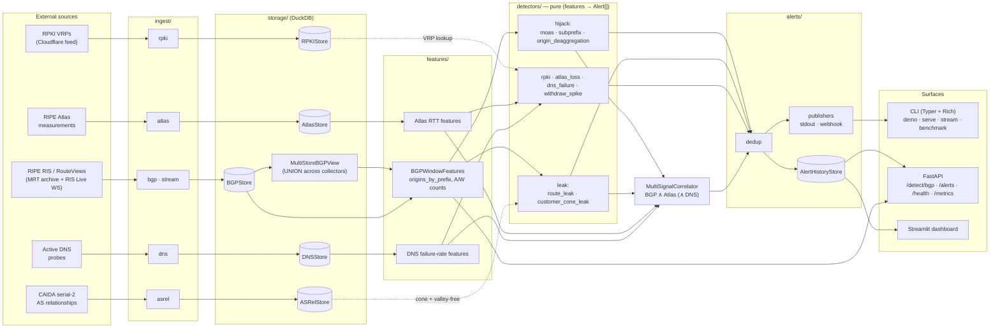

# Architecture

NetPulse is a multi-signal Internet-anomaly detector. It pulls raw
measurement data (BGP updates, AS relationships, RPKI ROAs, RIPE Atlas
latency, DNS probes) into local columnar storage, aggregates each signal
into per-window feature structs, runs a bank of stateless detectors over
those features, and emits structured alerts — with an optional fusion
layer that only fires when two independent signals agree.

The design goal is **a reproducible benchmark**: every detector is a pure
function of its input window, so the same code that runs against a live
RIPE RIS Live WebSocket also replays a 2008 MRT archive deterministically
and scores itself against a labeled-incident corpus.

## Pipeline



## Layers

| Layer | Package | Responsibility |
| ----- | ------- | -------------- |
| **Ingest** | `ingest/` | Pull from external feeds into local stores. libBGPStream for MRT + RIS Live; HTTP for CAIDA / RPKI / Atlas; a probe loop for DNS. The only layer that does network I/O. |
| **Storage** | `storage/` | One DuckDB-backed store per signal, each with an explicit schema module. `MultiStoreBGPView` is a read-only facade that `UNION ALL`s several BGP stores so detectors can run across collectors unchanged. |
| **Features** | `features/` | Aggregate raw rows into a per-window struct (e.g. `BGPWindowFeatures.origins_by_prefix`). One SQL `GROUP BY` per window; no detector logic here. |
| **Detectors** | `detectors/` | `DetectorBase[F]` — a pure function `score(features) -> list[Alert]`. No I/O, no shared state. This is where all detection logic lives and where almost all of the test surface is. |
| **Fusion** | `detectors/fusion.py` | Cross-correlate independent signals by time window. Fires one alert only when BGP **and** Atlas both trip; escalates to critical if DNS also fails. |
| **Alerts** | `alerts/` | The `Alert` dataclass, dedup, publishers (stdout / webhook), and a DuckDB `AlertHistoryStore` for the API/dashboard to query. |
| **Surfaces** | `cli.py`, `api/`, `dashboard/` | Typer+Rich CLI, FastAPI JSON API, Streamlit console. All three call the same detector bank. |
| **Benchmark** | `benchmark/` | The methodology layer: an `Incident` corpus, two replay modes, and TP/FN/GAP scoring. Not in the hot path — it *drives* the detectors against labeled data. |
| **Observability** | `observability.py` | Structured JSON logging, per-request IDs, and a Prometheus registry (`/metrics`). |

## Design decisions

### DuckDB as the substrate
Every store is an embedded DuckDB file. The data is append-only,
read-heavy, and analytical (`GROUP BY prefix, origin_as` over tens of
thousands of rows per window) — exactly DuckDB's columnar wheelhouse,
with zero operational footprint (no server, no daemon, ships as a
fixture in the repo). The `ATTACH ... AS read_only` mechanism makes the
multi-collector `UNION` view a dozen lines instead of an ETL job.
Postgres would add ops; SQLite would lose the columnar scan speed and
the `ATTACH`-many-catalogs ergonomics.

### Detectors are pure functions
`DetectorBase[F]` binds each detector to the feature type it consumes and
forces the signature `score(features) -> list[Alert]`. No detector
touches the network or the filesystem. Consequences:
- **Testable in isolation** — feed a hand-built `BGPWindowFeatures`, assert
  on the alerts. Detector tests need no fixtures, no network, no DuckDB;
  the suite is 143 tests at ~80% line coverage overall.
- **Same code, live or replayed** — the streaming tap and the MRT replay
  both produce the same feature struct, so detection is identical.
- **Composable** — fusion just consumes other detectors' outputs.

### Three leak detectors, not one
RFC 7908 route leaks are detected two ways because neither alone is
sufficient on real data:
- **`route_leak`** does a pair-direction valley-free check using CAIDA's
  inferred relationships. Fast, precise — but *abstains* when CAIDA lacks
  a relationship for an AS pair (the 2017 Google→NTT leak has an
  `unknown` step, so this detector stays silent).
- **`customer_cone_leak`** asks a different question: "is this transit AS
  outside the customer cone of the networks it's carrying?" It fires on
  exactly the cases valley-free can't see.

Shipping both, and documenting *which* catches *which* incident, is the
honest answer — collapsing them into one fused score would hide the
precision/recall tradeoff. See [BENCHMARK.md](BENCHMARK.md).

### Two latency numbers, not one
Replay supports both a **chunk-bounded** mode (`--chunk 1m`: process the
window in fixed slices, report the slice boundary) and a **per-record
streaming** mode (walk records in timestamp order, stop at the first
qualifying one). They measure different things and the project reports
both: chunk mode reflects a batch deployment's quantization ceiling;
streaming mode is the true lower bound a live tap achieves (0 µs from
documented onset on the sub-prefix cases, because the first qualifying
record *is* the onset record in the archive).

### Corpus methodology: TP / FN / GAP
A replayed incident scores as one of three outcomes, not two:
- **TP** — the expected detector fired on-target.
- **FN** — the detector saw the data and missed (a real failure).
- **GAP** — the data is present but no shipped detector models this shape
  yet (a *documented* limitation, e.g. origin-deaggregation before that
  detector existed).

Separating GAP from FN keeps the headline honest: a missing detector is a
roadmap item, not a false negative. Every incident is backed by a primary
source and verified against the archive — there is a hard "no fabricated
data" rule (see [`data/incidents/_README.md`](data/incidents/_README.md)).

### Multi-collector union without dedup
A single RIS collector only sees its own peers, so regional hijacks can be
invisible from `rrc00` while obvious from `rrc13`. `MultiStoreBGPView`
unions several stores so a detector sees the union of vantage points.
Duplicate records across collectors are deliberately *not* de-duplicated:
feature extraction's `GROUP BY prefix, origin_as, update_type` already
collapses them, and streaming replay stops at the first occurrence in
time order — so the union widens coverage without inflating counts.

## Request lifecycle (HTTP `POST /detect/bgp`)

```
client → FastAPI build_app()
  → RequestLoggingMiddleware            (assigns x-request-id, structured log)
  → detect_bgp(DetectRequest)
      → extract_bgp_features(store, start_us, end_us)   (one GROUP BY)
      → [MOASDetector, SubPrefixHijackDetector, …].score(features)
      → metrics.observe(duration)       (Prometheus histogram)
  → DetectResponse(alerts=[…])          (same Alert shape the CLI prints)
```

The CLI `demo`/`detect` path and the Streamlit dashboard hit the exact
same feature-extraction + detector calls; the API is a thin transport
over the core, not a reimplementation.

## Where to start reading

- A detector: [`detectors/subprefix.py`](src/netpulse/detectors/subprefix.py) (the
  canonical hijack case) and its test
  [`tests/test_detectors_subprefix.py`](tests/test_detectors_subprefix.py).
- The feature contract: [`features/bgp.py`](src/netpulse/features/bgp.py).
- The benchmark loop: [`scripts/run_corpus_benchmark.py`](scripts/run_corpus_benchmark.py)
  and [`benchmark/streaming_replay.py`](src/netpulse/benchmark/streaming_replay.py).
- The methodology + results: [BENCHMARK.md](BENCHMARK.md).
