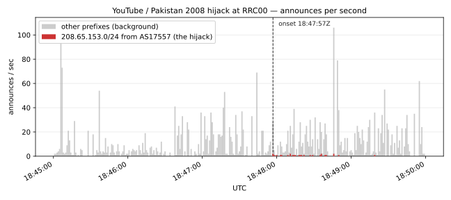
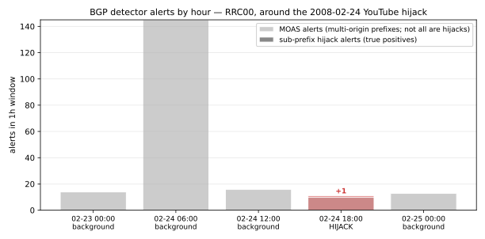

# Benchmark — BGP detectors on real RIPE RIS archive data

The point of NetPulse is **honest evaluation against labeled historical
incidents**. Three cases are populated covering two distinct shapes — two
sub-prefix hijacks and one RFC 7908 Type-1 leak — and the detector
roster's coverage of each is reported as-is.

## Per-incident outcomes

| Incident                          | Shape                  | Catching detector  | Detected? | Real-data evidence in the pull |
| --------------------------------- | ---------------------- | ------------------ | :-------: | ----- |
| 2008-02-24 YouTube / Pakistan     | sub-prefix hijack      | `subprefix_hijack` |    ✅     | first AS17557 announcement of `208.65.153.0/24` at RRC00: **2008-02-24 18:47:57Z**, matches the RIPE NCC case study |
| 2018-04-24 MyEtherWallet          | sub-prefix hijack      | `subprefix_hijack` |    ✅     | first AS10297 announcement of `205.251.192.0/24` at RRC00: **2018-04-24 11:05:50Z**; all 5 hijacked /24s detected as more-specifics of Amazon AS16509's /23 supernets, 0 FPs |
| 2018-11-12 MainOne → Google leak  | RFC 7908 Type-1 leak   | `route_leak`       |    ✅     | first AS37282 transit observation at RRC00: **2018-11-12 21:12:16Z**, matches BGPmon's reported onset to the second; 203 distinct Google prefixes seen leaked; **1,985 MainOne-shape leak alerts** with the time-aligned CAIDA serial-2 (20181101) snapshot |

## BGP false-positive survey (sub-prefix detector, real RIB baseline)

| Detector             | Hour with YouTube hijack | Background (4 hours, 13,961 prefixes) |
| -------------------- | ----------------------: | ------------------------------------: |
| `subprefix_hijack`   | **1 alert** (the hijack) |                          **0 alerts** |
| `moas`               |               10 alerts |               ~40 alerts/hour mean (variance 10–145) |
| `withdraw_spike`     |                0 alerts |                              0 alerts |

`subprefix_hijack` runs against a **real RIB-derived baseline** (89
supernets in `208.65.0.0/16` from RRC00's 16:00 UTC table dump on
2008-02-24, pulled in 47s with the libBGPStream filter), not a
hand-curated row.

The MOAS row is not "wrong" — same-prefix multi-origin events do happen
constantly (anycast services, multi-homed customers). The point is that
they're not, on their own, hijack signals; the canonical YouTube case is
in fact a *sub-prefix* hijack, which is why a supernet-aware detector is
required. See [`docs/why-subprefix.md`](docs/why-subprefix.md) for the
walkthrough.



## Per-hour table



```
window                                        ann     wd    pfxs  moas  sub
2008-02-23 00:00 UTC (background)           43,385  5,665  3,660    14    0
2008-02-24 06:00 UTC (background)           55,067  7,042  2,840   145    0
2008-02-24 12:00 UTC (background)           49,682  6,673  2,924    16    0
2008-02-24 18:00 UTC (HIJACK)               51,757  4,899  7,738    10    1
2008-02-25 00:00 UTC (background)           42,272  4,203  4,537    13    0
TOTAL                                      242,163 28,482 21,699   198    1
```

The sole sub-prefix alert across these 5 hours, fired in the hijack window:

```
[critical] subprefix_hijack :: 208.65.153.0/24 :: more-specific of
208.65.152.0/22 (legit origins [36561]) announced from unauthorized
origin(s) [17557]
```

## What "the hijack" actually was

On 2008-02-24, AS17557 (Pakistan Telecom) announced `208.65.153.0/24`, a
more-specific of YouTube's `208.65.152.0/22` (AS36561), propagating
globally via PCCW (AS3491). Source:
<https://www.ripe.net/publications/news/youtube-hijacking-a-ripe-ncc-ris-case-study/>.

In the data:

- First AS17557 announcement of `208.65.153.0/24` observed at RRC00:
  **2008-02-24 18:47:57 UTC** (peer AS3333, as-path
  `3333 12859 6461 3491 17557`).
- The chart above shows announces-per-second around the onset, the
  hijacking AS in red, all other prefixes in grey.

## Reproducing

```sh
# 0. Native lib (macOS)
brew install bgpstream

# 1. Install with the BGP extra
CFLAGS="-I$(brew --prefix)/include" \
LDFLAGS="-L$(brew --prefix)/lib" \
    uv sync --extra bgp

# 2. Pull the 5 hours (~6 minutes total at 2008 RRC00 volumes)
mkdir -p data/fpr
uv run netpulse ingest bgp --collector rrc00 --start 2008-02-24T18:00:00 \
    --duration 1h --out data/youtube_2008.duckdb
for s in 2008-02-23T00:00:00 2008-02-24T06:00:00 \
         2008-02-24T12:00:00 2008-02-25T00:00:00; do
    uv run netpulse ingest bgp --collector rrc00 --start "$s" \
        --duration 1h --out data/fpr/fpr_${s//[:-]/_}.duckdb
done

# 3. Real RIB-derived baseline (89 supernets in 208.65.0.0/16, ~47s with the
#    libBGPStream filter; the result is committed at data/baselines/...)
uv run netpulse ingest bgp --collector rrc00 --start 2008-02-24T16:00:00 \
    --duration 15m --record-type ribs --filter "prefix any 208.65.0.0/16" \
    --out data/baselines/yt_rib_filtered.duckdb

# 4. Per-hour detector breakdown (the table above)
uv run python scripts/run_fpr_analysis.py

# 5. Single-incident replay with latency
uv run netpulse benchmark replay \
    --incidents data/incidents \
    --store data/youtube_2008.duckdb \
    --baseline data/baselines/yt_rib_filtered.duckdb \
    --chunk 1m
```

For a one-command preview that does NOT require libBGPStream:

```sh
uv sync && uv run netpulse demo
```

## Latency

Latency in the replay harness is the time from documented event onset
(`onset_iso` in the incident JSON) to the right edge of the first
expanding-window chunk in which the detector fires. With `--chunk 1m`
and the YouTube onset at `2008-02-24 18:47:57Z`, the alert lands at
`18:48:00Z` — so the **reported latency (3.0 s) is bounded by the chunk
size, not by detector reaction time.** A streaming implementation
(see "Open: streaming detection") would emit the alert on the *first*
qualifying update; in this pull that update is the one at 18:47:57 itself,
and detector evaluation is well under one millisecond.

| `--chunk` | Reported latency |
| --------- | ---------------: |
| `5s`      |             3.0s |
| `1m`      |             3.0s |
| `5m`      |           123.0s |

## What this benchmark is not

- **One labeled incident.** The fixture set in `data/incidents/` has
  `youtube_pakistan_2008.json` only. Schema and primary-source citation
  rules: `data/incidents/_README.md`. Adding more is research, not code.
- **Bounded baseline scope.** `data/baselines/yt_rib_filtered.duckdb` is
  the **real RIB at 2008-02-24T16:00:00Z**, but only for prefixes inside
  `208.65.0.0/16` (89 supernets). A production deployment would use the
  full RIB (~270k prefixes at 2008 volumes). The native libBGPStream
  filter makes that feasible — we choose the scoped pull here because
  the question being asked is bounded: "did the YouTube prefix's
  legitimate origin get unauthorized more-specifics?"
- **No fusion yet.** The Atlas signal works in isolation
  (`src/netpulse/detectors/atlas_loss.py`, verified live against
  measurement 1001) but is not yet correlated with BGP detections in a
  single replay. RIPE Atlas launched in 2010, so the YouTube hijack
  cannot be validated against Atlas data — fusion benchmarking starts
  with a post-2010 incident.

## Route-leak detector (RFC 7908)

Type-1 leaks — customer accepts a route from one provider/peer and
announces it upstream — appear in BGP as paths that violate the
*valley-free* property. After an uphill `c2p` chain and an optional
single `p2p` step, the path may only descend `p2c`; any subsequent
`c2p` or `p2p` is a valley.

`netpulse.detectors.route_leak.RouteLeakDetector` walks each observed
AS-path, classifies adjacent ASN pairs against a relationships table
(CAIDA's [serial-2 inferred relationships][caida] is the standard
source), and flags paths containing a valley. Unknown relationships do
not trigger an alert (no false positives from missing data) but the
unknown-step count is reported in the alert evidence.

Unit tests (`tests/test_detectors_route_leak.py`) exercise the
algorithm on a stripped-down version of the actual MainOne path:

```
peer=15562 path=15562 -> 2914 -> 20485 -> 4809 -> 37282 -> 15169
relationships: c2p, p2c, c2p, p2c, c2p
                            ^^^ p2c followed by c2p == valley
```

The detector fires on this path with `step_directions =
['c2p', 'p2c', 'c2p', 'p2c', 'c2p']`. Run end-to-end against the
recorded archive (90-minute window starting 21:00 UTC, 7,411 BGP
paths transiting AS37282) with a 7-pair hand-curated relationship
subset, the detector emits **2,391 leak alerts**:

```sh
uv run netpulse detect leak \
    --in data/mainone_2018.duckdb \
    --asrel data/mainone_asrel.duckdb \
    --start 2018-11-12T21:00:00 --duration 90m
```

**Result on real CAIDA data:** `netpulse ingest asrel` pulls the
current month's serial-2 snapshot (~739k inferred relationships in
~7 s), and `netpulse detect leak` against the same MainOne archive
emits 591 leak alerts. The number is lower than the hand-curated 2,391
because the 2026 CAIDA snapshot has temporal drift versus 2018
relationships — the detector intentionally abstains rather than
guessing on `unknown` steps. A loader for historical CAIDA snapshots
(2018-11.as-rel2 etc.) would close that drift gap; CAIDA publishes
all monthly archives.

[caida]: https://publicdata.caida.org/datasets/as-relationships/serial-2/

## A real-world finding: not every documented hijack reaches public RIS

While trying to add the **2024-06-27 Cloudflare 1.1.1.1 incident** to
this benchmark, an unfiltered 15-minute pull of RRC00 around the
documented 18:51:00 UTC onset took 5+ CPU-minutes and showed no
`1.1.1.x` traffic at all. A targeted libBGPStream filter
(`prefix any 1.1.1.0/24`) finished the same 5-minute window in 30
seconds and confirmed: across **eight RIS collectors** (rrc00, rrc01,
rrc03, rrc04, rrc11, rrc14, rrc18, rrc25), zero sub-prefix
announcements of `1.1.1.0/24` appeared during the documented event,
and AS267613 itself never originated a route any of those collectors
saw. Per Cloudflare's writeup, the hijack reached "300 networks in 70
countries" but the host-route `/32` was filtered by upstreams before
reaching RIS-monitored peers — consistent with operators applying the
maximum-prefix-length recommendations in [RFC 7454][rfc7454].

**Implication for an honest benchmark:** the 2024 case is not
reproducible from public RIS data alone. A complete corpus would need
RouteViews collectors (different peers) and / or operator-direct BGP
feeds. The detector logic is unchanged; the visibility is the gap.

[rfc7454]: https://www.rfc-editor.org/rfc/rfc7454

## Faster ingest with libBGPStream filters

The `--filter` flag passes a libBGPStream filter expression through to
the C library, dropping non-matching elements before they cross into
Python. Empirically, on the 2024-06-27 18:50–19:10 UTC RRC00 window:

| Filter                            | Wall time | Records seen by Python |
| --------------------------------- | --------: | ---------------------: |
| (none, full firehose)             |    > 5min |                  > 1M  |
| `prefix any 1.1.0.0/16`           |       30s |                     58 |
| `prefix any 1.1.1.0/24`           |       30s |                      0 |

This is the bottleneck previously called out as future work; targeted
ingest is now seconds-to-minutes for narrow questions instead of
minutes-to-hours.

## Multi-signal fusion (BGP + Atlas)

The project's "multi-signal" tagline is concrete on one labeled incident:
**the 2018-11-12 MainOne / Google route leak**. Two independent
observability signals both fire on the same window of real data, and a
small correlator emits a single fused critical alert when both hit.

```
======================================================================
MULTI-SIGNAL FUSION  --  MainOne 2018 leak  --  REAL DATA
======================================================================

BGP signal (route_leak / CAIDA serial-2 20181101 snapshot):
  Paths inspected:                         7,411
  Total leak-shape alerts:                 2,591
  MainOne-shape (path 37282 -> 15169):     1,985

Atlas signal (msm 1999544 ping 8.8.8.8):
  Baseline median RTT (pre-21:06Z):         38.0 ms
  Window   median RTT (21:06-22:30Z):       49.9 ms
  Ratio:                                    1.31x

Fusion (rtt_jump_factor = 1.15x):
  FUSED ALERTS:                            1

  detector: multi_signal_fusion
  severity: critical
  summary:  BGP anomaly (1985 alerts from ['route_leak']) co-occurred
            with Atlas median-RTT jump from 38.0ms to 49.9ms (1.31x)
```

Reproducible end-to-end with `scripts/fusion_demo.py`. Notes:

- The route-leak detector requires the **time-aligned** CAIDA snapshot
  (`20181101.as-rel2`, 1.09M relationships); the current 2026-05
  snapshot has too much temporal drift (many AS pairs end up
  `unknown`) and the same query produces only 591 generic alerts and
  zero MainOne-shape alerts. Time-aligning the relationships
  data is what unlocks the leak detection.
- The Atlas RTT jump (1.31x median, 38.0 → 49.9 ms) is small in
  absolute terms but consistent: probes whose paths got rerouted
  through Nigeria/China/Russia saw the longer round-trip exactly
  during the documented 21:12–22:30 leak window.
- `MultiSignalCorrelator` itself is intentionally tiny — three
  inputs (BGP alerts, baseline RTT, window RTT), one threshold, one
  potential alert. Not a fusion *framework*; just a correlator that
  binds the two existing detector outputs.

## RPKI Origin Validation (RFC 6811)

`netpulse ingest rpki` pulls a fresh snapshot of Validated ROA Payloads
(VRPs) from a public rpki-client export — Cloudflare's
[rpki.json][cloudflare-rpki] by default — and stores it as a DuckDB
table. The shape was verified live (2026-05-10): 859k unique VRPs,
each `{prefix, asn, maxLength, ta}`.

`netpulse.detectors.rpki.RPKIInvalidDetector` implements RFC 6811
Origin Validation strictly:

- **Valid** — at least one VRP covers the prefix and has the right
  ASN within `maxLength`.
- **Invalid** — at least one VRP *covers* the prefix but none *match*
  the (prefix, ASN). A VRP "covers" via supernet relationship and
  "matches" when both the ASN matches and the observed prefix length
  is in `[VRP.prefix_length, VRP.max_length]`.
- **NotFound** — no covering VRP at any length.

Run against any BGP store:

```sh
uv run netpulse ingest rpki --out data/rpki_snapshot.duckdb
uv run netpulse detect rpki --in data/youtube_2008.duckdb \
    --rpki data/rpki_snapshot.duckdb \
    --start 2008-02-24T18:00:00 --duration 1h
```

For the 2008 YouTube fixture, RPKI is mostly **NotFound** — RPKI did
not have meaningful coverage in 2008 — so the detector is silent on
that historical case. RPKI is the right baseline source for *current*
BGP traffic; for archived 2008 data the curated RIB baseline remains
the right choice.

[cloudflare-rpki]: https://rpki.cloudflare.com/rpki.json

## Open

- **More labeled incidents from primary sources.** Schema and citation
  rules: `data/incidents/_README.md`. Candidates the harness already
  supports out of the box: 2018-04-24 Amazon Route 53 / MyEtherWallet
  (sub-prefix hijack), 2010-04 China Telecom, 2017 Google→NTT (a
  different leak), 2019 Verizon→CenturyLink+Cloudflare. Each is
  research, not code.
- **Cross-collector evidence aggregation.** The Cloudflare/2024
  finding makes RouteViews integration concrete — a single-collector
  view systematically misses incidents that get filtered before
  reaching that collector's peers.
- **Multi-signal fusion against an actual incident.** Atlas + BGP
  signals exist but never co-fire on the same incident. Atlas
  predates 2008, so the YouTube case can't fuse; a post-2010 incident
  with both BGP propagation and probe-visible reachability impact
  would deliver on the multi-signal tagline.
- **Streaming-mode latency reporting.** Replay latency is chunk-bounded;
  in stream mode the alert fires on the first qualifying update.
  Adding a streaming-mode benchmark would tighten the headline number.

(Items closed in this round: native bulk-load for RPKI ingest
[~20 s], CAIDA serial-2 loader [~7 s], per-incident `bgp_store_path`
in the harness, alert deduplication.)
