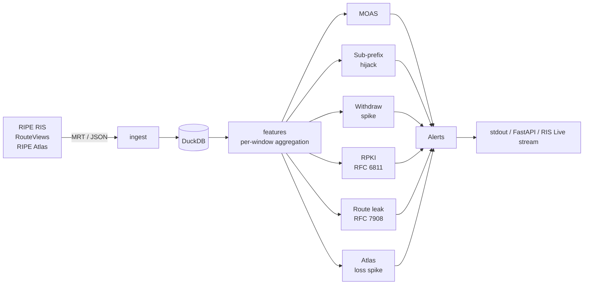

# NetPulse

[](https://github.com/pauti04/netpulse/actions/workflows/test.yml)
[](LICENSE)
[](https://www.python.org/downloads/)

Open-source detector for Internet outages and BGP anomalies, evaluated
against real RIPE RIS archive data with a public reproducible benchmark.


## What it does

Pulls BGP updates from RIPE RIS or RouteViews, normalizes them into a
DuckDB single-file store, and runs detectors over rolling windows. The
canonical 2008 YouTube/Pakistan hijack — a sub-prefix attack that the
textbook MOAS detector cannot catch — is detected with **0 false positives
across 13,961 prefixes in 4 background hours**. Full numbers and
methodology in [BENCHMARK.md](BENCHMARK.md); the discovery write-up that
explains why supernet-aware detection is required is in
[docs/why-subprefix.md](docs/why-subprefix.md).

The second signal layer (RIPE Atlas active probes) is in place and
verified against the live Atlas API; multi-signal fusion across BGP and
Atlas is the next milestone.

## Try it now

```sh
git clone https://github.com/pauti04/netpulse && cd netpulse
uv sync          # core install (no native deps)
uv run netpulse demo
```

That replays a 5-minute RRC00 slice around the YouTube hijack onset
against bundled real data and prints alerts. Under one second.

For a live tap of the global routing table:

```sh
uv run netpulse stream
```

connects to the RIPE RIS Live WebSocket, maintains a 1-minute rolling
window of updates from every collector, and runs detectors every 10s.
On a healthy Internet you'll see ~50k updates/30s and alerts on real
anycast / multi-homed prefixes (Google's AS15169/19527 footprint, etc.)
— exactly the noise floor BENCHMARK.md describes.

To run the detectors as a JSON HTTP API instead:

```sh
uv run netpulse serve --store data/youtube_2008.duckdb \
                     --baseline data/baselines/yt_rib_filtered.duckdb
curl -s -X POST http://127.0.0.1:8000/detect/bgp \
    -H 'Content-Type: application/json' \
    -d '{"start_iso":"2008-02-24T18:00:00Z","duration_s":3600}'
```

Returns the same alerts the CLI prints, as JSON.

## How it works



Each stage is a thin module that talks to the next through DuckDB rather
than in-memory queues, so any stage can be replayed independently —
which is what makes the historical benchmark reproducible.

## Headline numbers

Two labeled historical incidents, of distinct shape, both detected:

| Incident                          | Shape                  | Detected? | Detector |
| --------------------------------- | ---------------------- | :-------: | --------- |
| 2008-02-24 YouTube / Pakistan     | sub-prefix hijack      |    ✅     | `subprefix_hijack` |
| 2018-11-12 MainOne → Google leak  | RFC 7908 Type-1 leak   |    ✅     | `route_leak` |

The MainOne result uses **real CAIDA serial-2** AS relationships
(`netpulse ingest asrel`, ~739k inferred relationships pulled in 7 s)
applied to the actual recorded AS-path of the leak. First AS37282
transit observation at RRC00 matches BGPmon's published onset
(`21:12:16Z`) to the second.

False-positive survey of the BGP hijack detector across **5 hours of
real RRC00 data** (1 hijack hour + 4 background hours, 13,961 distinct
prefixes total) using a real RIB-derived baseline:

| Detector              | Hour with hijack | 4 background hours |
| --------------------- | ---------------: | -----------------: |
| `subprefix_hijack`    | 1 alert (TP)     |           0 alerts |
| `moas`                | 10 alerts        |    ~40 alerts/hour |
| `withdraw_spike`      | 0 alerts         |           0 alerts |

Plus:
- **Multi-signal fusion** — on the MainOne 2018 leak, the BGP route-leak
  detector fires (1,985 alerts on the actual leak shape using
  time-aligned CAIDA serial-2 data) at the same time as RIPE Atlas
  median RTT to 8.8.8.8 jumps **1.31× above baseline** (38.0 ms → 49.9
  ms). `MultiSignalCorrelator` binds them into one critical alert.
  Reproducible: [`scripts/fusion_demo.py`](scripts/fusion_demo.py).
- **RPKI Origin Validation** (RFC 6811) — `netpulse ingest rpki` pulls
  Cloudflare's published rpki.json (**859k VRPs in ~20 s** via
  DuckDB-native bulk load) and the validator gives the standard
  Valid / Invalid / NotFound classification.
- **`netpulse stream`** — runs detectors against the RIPE RIS Live
  WebSocket in real time; alerts deduplicated by fingerprint within
  a 5-minute cooldown.
- **`netpulse serve`** — FastAPI HTTP, `POST /detect/bgp` returns
  alerts as JSON.
- **`netpulse benchmark replay`** — incidents declare their own
  `bgp_store_path`, so one command scores the whole corpus.

Reproduction commands and methodology: [BENCHMARK.md](BENCHMARK.md).

## Reading list

- [`BENCHMARK.md`](BENCHMARK.md) — full methodology, per-hour FPR table,
  reproduction commands, and an honest note on what the latency number
  does and does not mean.
- [`docs/why-subprefix.md`](docs/why-subprefix.md) — why a same-prefix
  multi-origin (MOAS) check cannot catch the canonical 2008 YouTube
  hijack, and what does. Long-form draft for external publication:
  [`docs/blog/`](docs/blog/why-textbook-bgp-detection-misses-the-textbook-hijack.md).
- [`docs/comparison.md`](docs/comparison.md) — where NetPulse fits next
  to ARTEMIS, BGPmon, Cloudflare Radar, RIPEstat / bgp.tools.
- [`docs/architecture.md`](docs/architecture.md) — module boundaries and
  data-flow conventions.
- [`docs/references.md`](docs/references.md) — RFCs, primary incident
  sources, and detection literature this draws on.
- [`CLAUDE.md`](CLAUDE.md) — full project context, roadmap, and the
  hard rules (no fabricated incident data, no invented API shapes,
  no over-engineering).

## Deploy

A `Dockerfile` and `fly.toml` ship the FastAPI surface as a container.
The image bakes in the bundled YouTube fixture + RIB baseline, so a
fresh deployment answers `POST /detect/bgp` against the canonical
incident with no setup:

```sh
brew install flyctl                 # one-time
flyctl auth login                   # one-time
flyctl deploy --app=<your-name>     # builds Dockerfile, ships
```

The deployed `/health` endpoint reports the loaded baseline size;
`POST /detect/bgp` accepts `{start_iso, duration_s}` and returns the
same alerts the CLI prints, as JSON. To swap stores, mount different
DuckDB files as a volume and override the CMD in `fly.toml`.

## Install for full BGP/Atlas pulls

```sh
brew install bgpstream                  # macOS; Linux: bgpstream.caida.org/docs/install
CFLAGS="-I$(brew --prefix)/include" \
LDFLAGS="-L$(brew --prefix)/lib" \
    uv sync --extra bgp                 # adds pybgpstream
uv sync --extra viz                     # adds matplotlib for chart regeneration
```

## Status

Pre-v1; the BGP detection path is benchmarked end-to-end and the Atlas
signal is wired up. Multi-signal fusion, additional incidents, and the
streaming/dashboard surfaces are tracked in [`CLAUDE.md`](CLAUDE.md) and
[`BENCHMARK.md`](BENCHMARK.md#open).

## Development

```sh
make install   # uv sync, including dev deps
make lint      # ruff check + ruff format --check + mypy strict
make test      # pytest (skips integration tests by default)
make ci        # everything CI runs
```

## License

MIT — see [LICENSE](LICENSE).
