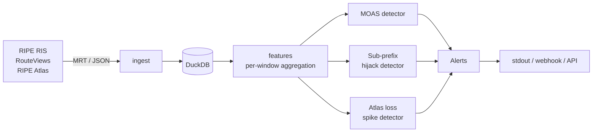

# NetPulse

[](https://github.com/pauti04/netpulse/actions/workflows/test.yml)
[](LICENSE)
[](https://www.python.org/downloads/)

Open-source detector for Internet outages and BGP anomalies, evaluated
against real RIPE RIS archive data with a public reproducible benchmark.


## What it does

Pulls BGP updates from RIPE RIS or RouteViews, normalizes them into a
DuckDB single-file store, and runs detectors over rolling windows. The
canonical 2008 YouTube/Pakistan hijack — a sub-prefix attack that the
textbook MOAS detector cannot catch — is detected with **0 false positives
across 13,961 prefixes in 4 background hours**. Full numbers and
methodology in [BENCHMARK.md](BENCHMARK.md); the discovery write-up that
explains why supernet-aware detection is required is in
[docs/why-subprefix.md](docs/why-subprefix.md).

The second signal layer (RIPE Atlas active probes) is in place and
verified against the live Atlas API; multi-signal fusion across BGP and
Atlas is the next milestone.

## Try it now

```sh
git clone https://github.com/pauti04/netpulse && cd netpulse
uv sync          # core install (no native deps)
uv run netpulse demo
```

That replays a 5-minute RRC00 slice around the YouTube hijack onset
against bundled real data and prints alerts. Under one second.

## How it works



Each stage is a thin module that talks to the next through DuckDB rather
than in-memory queues, so any stage can be replayed independently —
which is what makes the historical benchmark reproducible.

## Headline numbers

| Detector              | Hour with hijack | 4 background hours (13,961 prefixes) |
| --------------------- | ---------------: | -----------------------------------: |
| `subprefix_hijack`    | 1 alert (TP)     |                              0 alerts |
| `moas`                | 10 alerts        |                  ~40 alerts/hour mean |
| `atlas_loss_spike`    | n/a (Atlas <2010) |                            0 alerts (live) |

Reported on real RRC00 archive data (1h × 5 hours) and a 5-minute live
pull from Atlas measurement 1001. Per-hour breakdown and reproduction
commands: [BENCHMARK.md](BENCHMARK.md).

## Reading list

- [`BENCHMARK.md`](BENCHMARK.md) — full methodology, per-hour FPR table,
  reproduction commands, and an honest note on what the latency number
  does and does not mean.
- [`docs/why-subprefix.md`](docs/why-subprefix.md) — why a same-prefix
  multi-origin (MOAS) check cannot catch the canonical 2008 YouTube
  hijack, and what does.
- [`docs/architecture.md`](docs/architecture.md) — module boundaries and
  data-flow conventions.
- [`docs/references.md`](docs/references.md) — RFCs, primary incident
  sources, and detection literature this draws on.
- [`CLAUDE.md`](CLAUDE.md) — full project context, roadmap, and the
  hard rules (no fabricated incident data, no invented API shapes,
  no over-engineering).

## Install for full BGP/Atlas pulls

```sh
brew install bgpstream                  # macOS; Linux: bgpstream.caida.org/docs/install
CFLAGS="-I$(brew --prefix)/include" \
LDFLAGS="-L$(brew --prefix)/lib" \
    uv sync --extra bgp                 # adds pybgpstream
uv sync --extra viz                     # adds matplotlib for chart regeneration
```

## Status

Pre-v1; the BGP detection path is benchmarked end-to-end and the Atlas
signal is wired up. Multi-signal fusion, additional incidents, and the
streaming/dashboard surfaces are tracked in [`CLAUDE.md`](CLAUDE.md) and
[`BENCHMARK.md`](BENCHMARK.md#open).

## Development

```sh
make install   # uv sync, including dev deps
make lint      # ruff check + ruff format --check + mypy strict
make test      # pytest (skips integration tests by default)
make ci        # everything CI runs
```

## License

MIT — see [LICENSE](LICENSE).
