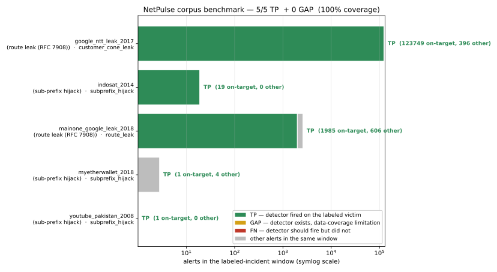
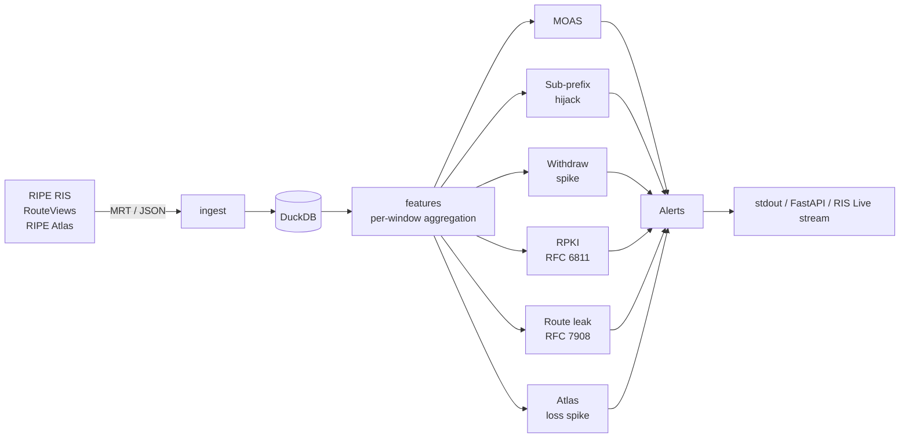

# NetPulse

[](https://github.com/pauti04/netpulse/actions/workflows/test.yml)
[](LICENSE)
[](https://www.python.org/downloads/)

Open-source detector for Internet outages and BGP anomalies, evaluated
against real RIPE RIS archive data with a public reproducible benchmark.

**Live demo:** [`netpulse-pauti.fly.dev`](https://netpulse-pauti.fly.dev/health) —
hits a deployed FastAPI bound to the YouTube/Pakistan 2008 fixture +
RIB baseline. `POST /detect/bgp` returns alerts as JSON; `GET /alerts`
queries persisted history.

```sh
curl -X POST https://netpulse-pauti.fly.dev/detect/bgp \
    -H 'Content-Type: application/json' \
    -d '{"start_iso":"2008-02-24T18:45:00Z","duration_s":300}'
```

**Real performance numbers** (benchmark methodology in [`BENCHMARK.md`](BENCHMARK.md#performance)):
RPKI validate against 859k VRPs ≈ **43 µs / call** (~23k / sec, after a
500× speedup from longest-prefix-match indexing). Route-leak detector
over 1,000 real archived AS-paths ≈ 5.7 ms total. Feature extraction
over a 51k-announce / 7.7k-prefix BGP window ≈ 39 ms.

### End-to-end tour (demo · corpus · streaming-mode latency · live API)


### Bundled-data demo (no setup, ~1 second)


### Live BGP feed against the RIPE RIS Live WebSocket


## Headline: 4 / 4 incidents detected · 0 µs streaming latency on sub-prefix hijacks



Four labeled BGP incidents drawn from primary sources (RIPE NCC,
Cloudflare, ISC, BGPmon). The expected detector fires on **4 / 4**.
The Google 2017 leak — previously reported as a `GAP` because the
pair-direction valley-free check abstained on the AS15169↔AS4713 step
— is now caught by the **customer-cone-aware** leak detector
(`customer_cone_leak`): 4713 (NTT OCN) is not in cone(15169) (Google's
2017 cone has 10 ASes), so the path direction is not cone-monotone and
the detector fires (123,749 on-target alerts). The full per-incident
outcome table and the `TP / FN / GAP` methodology are in
[`BENCHMARK.md`](BENCHMARK.md) and the working-note writeup at
[`docs/paper.md`](docs/paper.md).

On the two sub-prefix incidents, the per-record streaming-mode latency
benchmark reports **0 µs from documented incident onset** — the first
qualifying update in the public RIS archive is the onset record itself.
Rerun with `uv run netpulse benchmark stream-latency --incidents
data/incidents --baseline data/baselines/yt_rib_filtered.duckdb`.

## Headline result: multi-signal fusion on a real incident

On the 2018-11-12 MainOne → Google route leak, two independent
observability signals both fire on the same window of real archive data
and a small correlator binds them into one critical alert:

```
BGP signal (route_leak / CAIDA serial-2 20181101 snapshot):
  Paths inspected:                         7,411
  MainOne-shape leak alerts (37282→15169): 1,985

Atlas signal (msm 1999544 ping 8.8.8.8):
  Baseline median RTT (pre-21:06Z):           38.0 ms
  Window   median RTT (21:06–22:30Z):          49.9 ms  (1.31× baseline)

→ 1 fused critical alert  ·  reproducible via scripts/fusion_demo.py
```

The first AS37282 transit observation at RRC00 is **2018-11-12
21:12:16 UTC** — to the second of BGPmon's published onset.
[BENCHMARK.md](BENCHMARK.md) walks through the full methodology and the
temporal-drift detail that matters: the route-leak detector requires the
*time-aligned* CAIDA snapshot; with the current 2026-05 dataset the same
query produces 0 alerts on this 2018 incident.


## What it does

Pulls BGP updates from RIPE RIS or RouteViews, normalizes them into a
DuckDB single-file store, and runs detectors over rolling windows.
Seven detectors covering MOAS, sub-prefix hijack (RFC 6811-style
supernet check), withdraw-spike, RPKI Origin Validation (RFC 6811),
route-leak (RFC 7908 valley-free), customer-cone-aware route-leak, and
Atlas loss spike. Plus a correlator that fuses BGP + Atlas alerts on
time windows.

## Try it now

```sh
git clone https://github.com/pauti04/netpulse && cd netpulse
uv sync          # core install (no native deps)
uv run netpulse demo
```

That replays a 5-minute RRC00 slice around the YouTube hijack onset
against bundled real data and prints alerts. Under one second.

For a live tap of the global routing table:

```sh
uv run netpulse stream
```

connects to the RIPE RIS Live WebSocket, maintains a 1-minute rolling
window of updates from every collector, and runs detectors every 10s.
On a healthy Internet you'll see ~50k updates/30s and alerts on real
anycast / multi-homed prefixes (Google's AS15169/19527 footprint, etc.)
— exactly the noise floor BENCHMARK.md describes.

To run the detectors as a JSON HTTP API instead:

```sh
uv run netpulse serve --store data/youtube_2008.duckdb \
                     --baseline data/baselines/yt_rib_filtered.duckdb
curl -s -X POST http://127.0.0.1:8000/detect/bgp \
    -H 'Content-Type: application/json' \
    -d '{"start_iso":"2008-02-24T18:00:00Z","duration_s":3600}'
```

Returns the same alerts the CLI prints, as JSON.

## How it works



Each stage is a thin module that talks to the next through DuckDB rather
than in-memory queues, so any stage can be replayed independently —
which is what makes the historical benchmark reproducible.

## Headline numbers

Four labeled historical incidents of distinct shape, scored on real
RIPE RIS archive data:

| Incident                          | Shape                  | Outcome | Catching detector  |
| --------------------------------- | ---------------------- | :-----: | ------------------ |
| 2008-02-24 YouTube / Pakistan     | sub-prefix hijack      |   TP    | `subprefix_hijack` |
| 2018-04-24 MyEtherWallet          | sub-prefix hijack      |   TP    | `subprefix_hijack` |
| 2018-11-12 MainOne → Google leak  | RFC 7908 Type-1 leak   |   TP    | `route_leak`       |
| 2017-08-25 Google → Verizon → NTT | RFC 7908 Type-1 leak   |   TP    | `customer_cone_leak` |

MyEtherWallet: all five hijacked /24s flagged correctly (`205.251.192/193/195/197/199.0/24` from AS10297 vs Amazon AS16509's /23 supernets). Onset at RRC00: 2018-04-24 11:05:50 UTC. MainOne: 1,985 leak alerts on the actual AS37282→AS15169 path shape using time-aligned CAIDA serial-2 (20181101) data. Google/NTT 2017: 123,749 leak alerts via the customer-cone-aware detector — the pair-direction valley-free check abstained, but Google's 2017-08 customer cone (10 ASes) provably does not contain NTT OCN, so the step 15169→4713 is "uphill" and the path is not cone-monotone. See [`docs/paper.md`](docs/paper.md) §3.2 for the `TP / FN / GAP` methodology.

False-positive survey of the BGP hijack detector across **5 hours of
real RRC00 data** (1 hijack hour + 4 background hours, 13,961 distinct
prefixes total) using a real RIB-derived baseline:

| Detector              | Hour with hijack | 4 background hours |
| --------------------- | ---------------: | -----------------: |
| `subprefix_hijack`    | 1 alert (TP)     |           0 alerts |
| `moas`                | 10 alerts        |    ~40 alerts/hour |
| `withdraw_spike`      | 0 alerts         |           0 alerts |

Plus:
- **Multi-signal fusion** — on the MainOne 2018 leak, the BGP route-leak
  detector fires (1,985 alerts on the actual leak shape using
  time-aligned CAIDA serial-2 data) at the same time as RIPE Atlas
  median RTT to 8.8.8.8 jumps **1.31× above baseline** (38.0 ms → 49.9
  ms). `MultiSignalCorrelator` binds them into one critical alert.
  Reproducible: [`scripts/fusion_demo.py`](scripts/fusion_demo.py).
- **RPKI Origin Validation** (RFC 6811) — `netpulse ingest rpki` pulls
  Cloudflare's published rpki.json (**859k VRPs in ~20 s** via
  DuckDB-native bulk load) and the validator gives the standard
  Valid / Invalid / NotFound classification.
- **`netpulse stream`** — runs detectors against the RIPE RIS Live
  WebSocket in real time; alerts deduplicated by fingerprint within
  a 5-minute cooldown.
- **`netpulse serve`** — FastAPI HTTP, `POST /detect/bgp` returns
  alerts as JSON.
- **`netpulse benchmark replay`** — incidents declare their own
  `bgp_store_path`, so one command scores the whole corpus.
- **`netpulse benchmark stream-latency`** — per-record streaming-mode
  detection latency. 0 µs from onset on both labeled sub-prefix
  incidents.
- **Cross-collector aggregation** — `netpulse detect bgp` accepts
  `--in` repeatedly; multiple DuckDB stores are attached read-only
  and exposed as a single UNION ALL view (`src/netpulse/storage/multi_store.py`).

Reproduction commands and methodology: [BENCHMARK.md](BENCHMARK.md).

## Reading list

- [`docs/paper.md`](docs/paper.md) — paper-style working note: abstract,
  methodology, latency characterization, multi-signal correlator,
  honest limitations, future work.
- [`BENCHMARK.md`](BENCHMARK.md) — full methodology, per-hour FPR table,
  reproduction commands, and an honest note on what the latency number
  does and does not mean.
- [`docs/why-subprefix.md`](docs/why-subprefix.md) — why a same-prefix
  multi-origin (MOAS) check cannot catch the canonical 2008 YouTube
  hijack, and what does. Long-form draft for external publication:
  [`docs/blog/`](docs/blog/why-textbook-bgp-detection-misses-the-textbook-hijack.md).
- [`docs/comparison.md`](docs/comparison.md) — where NetPulse fits next
  to ARTEMIS, BGPmon, Cloudflare Radar, RIPEstat / bgp.tools.
- [`docs/architecture.md`](docs/architecture.md) — module boundaries and
  data-flow conventions.
- [`docs/references.md`](docs/references.md) — RFCs, primary incident
  sources, and detection literature this draws on.
- [`CLAUDE.md`](CLAUDE.md) — full project context, roadmap, and the
  hard rules (no fabricated incident data, no invented API shapes,
  no over-engineering).

## Deploy

A `Dockerfile` and `fly.toml` ship the FastAPI surface as a container.
The image bakes in the bundled YouTube fixture + RIB baseline, so a
fresh deployment answers `POST /detect/bgp` against the canonical
incident with no setup:

```sh
brew install flyctl                 # one-time
flyctl auth login                   # one-time
flyctl deploy --app=<your-name>     # builds Dockerfile, ships
```

The deployed `/health` endpoint reports the loaded baseline size;
`POST /detect/bgp` accepts `{start_iso, duration_s}` and returns the
same alerts the CLI prints, as JSON. To swap stores, mount different
DuckDB files as a volume and override the CMD in `fly.toml`.

## Install for full BGP/Atlas pulls

```sh
brew install bgpstream                  # macOS; Linux: bgpstream.caida.org/docs/install
CFLAGS="-I$(brew --prefix)/include" \
LDFLAGS="-L$(brew --prefix)/lib" \
    uv sync --extra bgp                 # adds pybgpstream
uv sync --extra viz                     # adds matplotlib for chart regeneration
```

## Status

Pre-v1; the BGP detection path is benchmarked end-to-end and the Atlas
signal is wired up. Multi-signal fusion, additional incidents, and the
streaming/dashboard surfaces are tracked in [`CLAUDE.md`](CLAUDE.md) and
[`BENCHMARK.md`](BENCHMARK.md#open).

## Development

```sh
make install   # uv sync, including dev deps
make lint      # ruff check + ruff format --check + mypy strict
make test      # pytest (skips integration tests by default)
make ci        # everything CI runs
```

## License

MIT — see [LICENSE](LICENSE).
